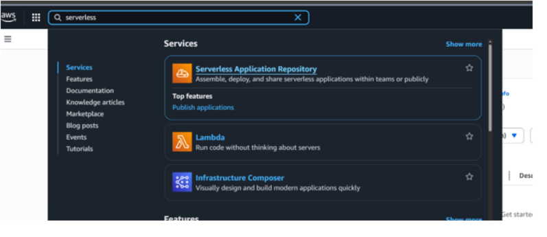
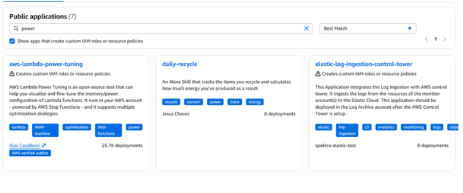
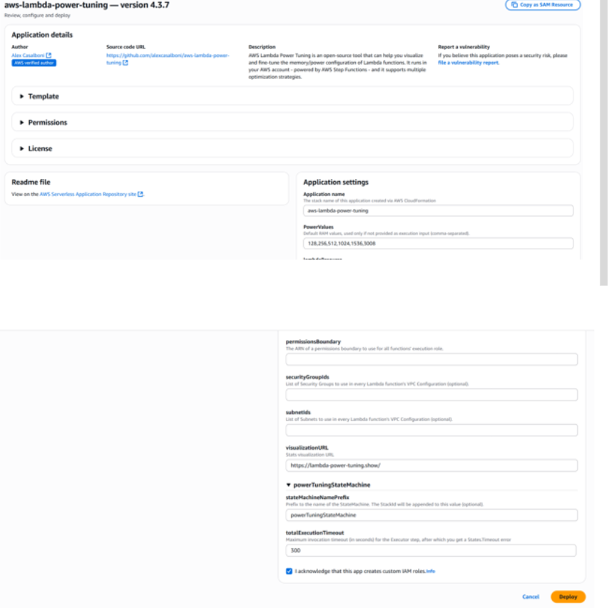
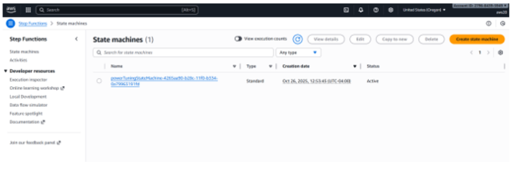
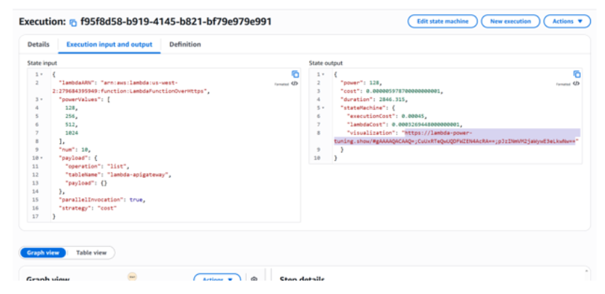
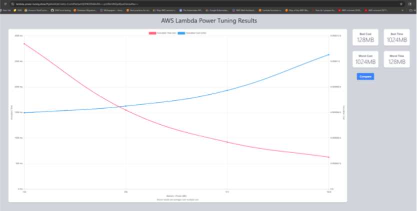

# Lambda Power Tuning — Setup Guide

Customers use this tool to determine the optimal memory to allocate to a Lambda function based on their goal — best performance, cheapest cost, or a balance of both (this maps directly to the AWS Well-Architected Framework pillars).

## Steps

1. Go to the **Serverless Application Repository**



2. Click **Available Applications**, type "power", and check **"Show apps that create custom IAM roles or resource policies"**



3. Select **aws-lambda-power-tuning**



4. Scroll down, keep everything as-is, check **"I acknowledge that this app creates custom IAM roles"**, and click **Deploy**

5. Once deployed, go to **Step Functions**



6. Select the **powerTuningStateMachine**, click **Start execution**
7. Get your Lambda ARN and insert it into the JSON below, then paste the whole JSON into the execution input:

```json
{
  "lambdaARN": "YOUR LAMBDA ARN HERE",
  "powerValues": [
    128,
    256,
    512,
    1024
  ],
  "num": 10,
  "payload": {
    "operation": "list",
    "tableName": "lambda-apigateway",
    "payload": {}
  },
  "parallelInvocation": true,
  "strategy": "cost"
}
```

8. Once execution completes, click the **Execution input and output** tab
9. Select and copy the **visualization link**



10. Open it in a new browser tab — this graph shows the cost and performance tradeoff across memory configurations



