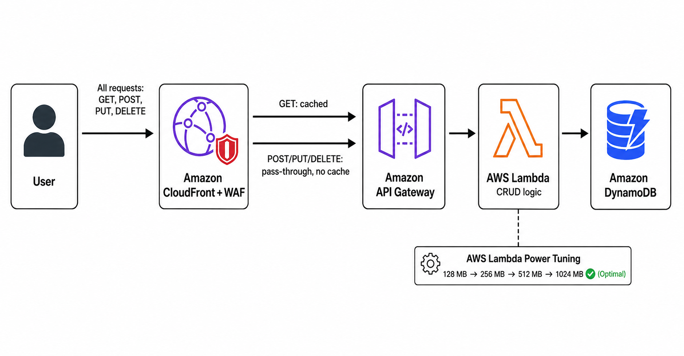

# Serverless Microservice — Cost & Performance Optimization with AWS Lambda Power Tuning

A production-oriented look at optimizing a serverless CRUD API (API Gateway → Lambda → DynamoDB) using AWS Lambda Power Tuning and real load testing — mapped to the AWS Well-Architected Framework's **Cost Optimization** pillar.

## Architecture

A production-ready design fronts the entire API with CloudFront — not just reads — providing TLS termination at the edge, AWS WAF integration, and a single unified domain. Caching applies only to GET/HEAD responses by CloudFront's design; writes always pass through to the origin.

---

## Load Testing — Postman Performance Test (Baseline)

**Test setup**
- Virtual users: 10 VU
- Load profile: Ramp up (30 seconds)
- Duration: 2 minutes

**Baseline results (128 MB, default Lambda memory)**

| Metric | Value |
|---|---|
| Total requests sent | 980 |
| Throughput | 12.46 requests/second |
| Average response time | 413 ms |
| P90 / P95 / P99 | 593 ms / 868 ms / 2,743 ms |
| Min / Max | 268 ms / 3,460 ms |
| Error rate | 0.00% |

All requests returned 2xx — no errors during the run.

---

## Cost Optimization — Lambda Power Tuning

[AWS Lambda Power Tuning](https://github.com/alexcasalboni/aws-lambda-power-tuning) was run across multiple memory configurations to find the optimal balance of cost and speed.

| Memory | Invocation Time | Invocation Cost |
|---|---|---|
| 128 MB | ~1,180 ms | Highest (worst) |
| 256 MB | ~370 ms | Mid |
| 512 MB | ~220 ms | Mid |
| 1024 MB | ~50 ms | **Lowest (best)** |

**Finding:** 1024 MB was both the fastest and cheapest configuration. Lambda bills on GB-seconds (memory × execution time), and CPU is allocated proportionally to memory — higher memory settings receive more CPU power, which is why execution time drops as memory increases. Under-provisioning memory increased total cost by extending execution time — the "cheap" 128 MB option was actually the most expensive.

### Applying the result — Before vs After

Lambda memory was updated from 128 MB to **1024 MB** (timeout increased to 5s), and the identical Postman load test was re-run.

| Metric | Before (128 MB) | After (1024 MB) | Improvement |
|---|---|---|---|
| Average response time | 413 ms | **136 ms** | **67% faster** |
| Throughput | 12.46 req/s | **44.58 req/s** | **3.6x increase** |
| P90 | 593 ms | 223 ms | 62% faster |
| P95 | 868 ms | 376 ms | 57% faster |
| P99 | 2,743 ms | **624 ms** | **77% faster** |
| Max | 3,460 ms | 2,569 ms | 26% faster |
| Total requests (same 2-min window) | 980 | 5,160 | 5.3x more requests handled |
| Error rate | 0.00% | 0.00% | No regressions |

**The result:** P99 latency dropped from 2,743 ms to 624 ms — a 77% reduction — while throughput increased 3.6x, all with zero errors. This is production-representative evidence that right-sizing Lambda memory is a low-effort, high-impact optimization before reaching for more complex scaling solutions.

### Estimated Cost Savings

Lambda bills per request ($0.20 per 1M requests) plus compute duration in GB-seconds ($0.0000166667 per GB-second, x86 pricing). Using the Power Tuning invocation times (128 MB ≈ 1,180 ms, 1024 MB ≈ 50 ms):

| Memory | GB-seconds per invocation | Compute cost per 1M requests |
|---|---|---|
| 128 MB | 0.1475 | $2.46 |
| 1024 MB | 0.0500 | **$0.83** |

**Savings: ~$1.63 per 1M requests — a 66% reduction in compute cost**, on top of the performance gains above.

*Note: Power Tuning's 128 MB baseline (1,180 ms) is based on a small 10-invocation sample and may be skewed by cold starts. Real-world steady-state savings will vary from this estimate — always validate with the AWS Pricing Calculator using your actual traffic patterns.*

Projected at production scale (request cost included):

| Monthly traffic | Cost at 128 MB | Cost at 1024 MB | Monthly savings | Annual savings |
|---|---|---|---|---|
| 10M requests | $26.60 | $10.30 | **$16.30** | **~$196** |
| 100M requests | $266.00 | $103.00 | **$163.00** | **~$1,956** |

*Estimates based on standard AWS Lambda x86 pricing (us-east-1); actual rates vary by region — verify with the [AWS Pricing Calculator](https://calculator.aws) for exact figures.*

---

## Key Takeaways

- Lambda memory tuning isn't guesswork — Power Tuning data flipped the assumption that low memory means low cost
- Right-sizing memory improved both speed and cost simultaneously — the same change that made the function faster also made it cheaper to run
- A single memory configuration change delivered a 77% P99 latency reduction and 3.6x throughput increase, validated with a real before/after production-style load test
- At production scale (100M requests/month), this single change saves an estimated **~$1,956/year** in compute cost alone
- This approach is directly reusable for any production Lambda function: benchmark, tune, validate, deploy

## Tools Used
- AWS Lambda Power Tuning
- Postman (Performance / Load Testing)
- Amazon API Gateway, AWS Lambda, Amazon DynamoDB
- Amazon CloudFront (architecture enhancement)
- Manual cost calculation based on published AWS Lambda pricing (verify with AWS Pricing Calculator)
